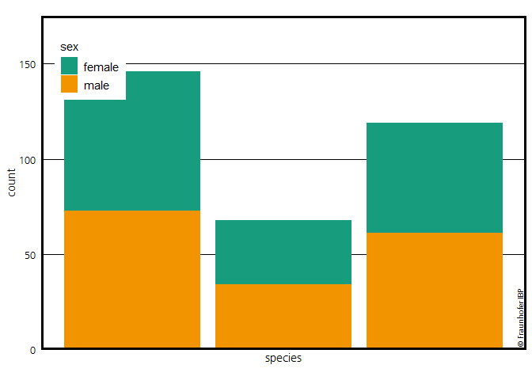
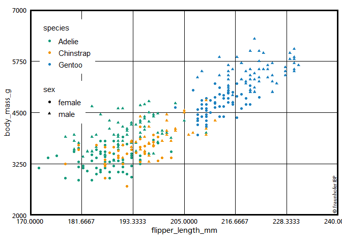
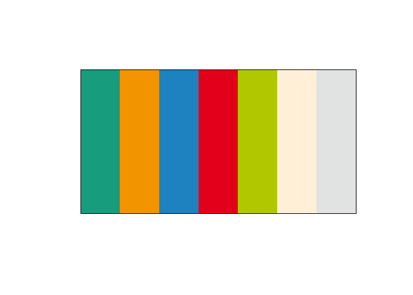

<!-- README.md is generated from README.Rmd. Please edit that file -->

# ggIBPplot

<!-- badges: start -->

<!-- badges: end -->

Stellt ein theme\_ibp für ggplot zur Vefügung. Zusätzlich einige
`scale_*` Funktionen mit Farben aus der CI vom Fraunhofer IBP.

## Installation

Gibts bisher nur manual. Eventuell von Github über;

``` r
devtools::install_github("SebaStad/ggIBPplot")
```

## Example

This is a basic example which shows you how to solve a common problem:

``` r
# remotes::install_github("allisonhorst/palmerpenguins")
library(ggplot2)
library(ggIBPplot)
library(magrittr)
## basic example code
palmerpenguins::penguins %>% 
  na.exclude() %>% 
{
ggplot(data = ., aes(x=species)) +
  geom_bar(aes(fill=sex)) +
  theme_ibp() +
  scale_y_continuous(expand = c(0,0), limits = c(0,175)) +
  scale_fill_ibp() +
  geom_fraunhofer_label() 
}
#> Warning in grid.Call(C_stringMetric, as.graphicsAnnot(x$label)):
#> Zeichensatzfamilie in der Windows Zeichensatzdatenbank nicht gefunden
#> Warning in grid.Call(C_textBounds, as.graphicsAnnot(x$label), x$x, x$y, :
#> Zeichensatzfamilie in der Windows Zeichensatzdatenbank nicht gefunden

#> Warning in grid.Call(C_textBounds, as.graphicsAnnot(x$label), x$x, x$y, :
#> Zeichensatzfamilie in der Windows Zeichensatzdatenbank nicht gefunden
```



``` r

palmerpenguins::penguins %>% 
  na.exclude() %>% 
{
ggplot(data = ., aes(x=flipper_length_mm, y = body_mass_g)) +
  geom_point(aes(colour=species, shape = sex)) +
  theme_ibp(y_pos_leg = 0.7) +
  scale_y_continuous(expand = c(0,0)) +
  scale_colour_ibp() +
  geom_fraunhofer_label() 
}
#> Warning in grid.Call(C_textBounds, as.graphicsAnnot(x$label), x$x, x$y, :
#> Zeichensatzfamilie in der Windows Zeichensatzdatenbank nicht gefunden
```

 Beeinhaltet
auch einige Farben aus der IBP CI.

``` r
prismatic::color(ibp_cols) %>% 
  plot()
```


