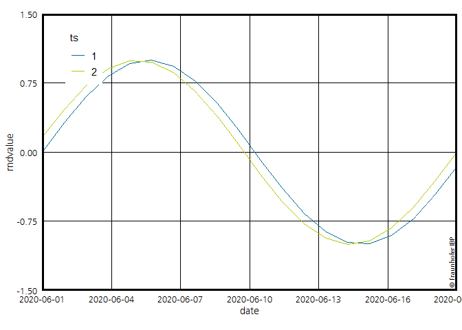
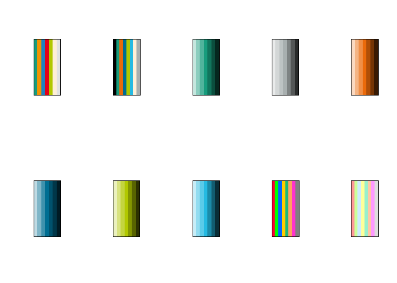

<!-- README.md is generated from README.Rmd. Please edit that file -->

# ggIBPplot

<!-- badges: start -->

<!-- badges: end -->

Stellt Funktionen und IBP\_themes für die Bibliothek ggplot2 zur
Verfügung. Mehrere `scale_*_ibp` Optionen, automatische Grid- und
Grenzen-Erkennung (breaks und limits) sowie Support für die Fraunhofer
Schriftart `Frutiger`. Limits können auch immer manuel gesetzt werden,
Grid etc wird automatisch richtig gesetzt.

## Installation

Bisher nur über Github:

``` r
devtools::install_github("SebaStad/ggIBPplot")
```

## Import von Schriftarten

Zunächst ein Beispiel, wie man alle in Windows vorhanden Schriftarten in
R einlesen kann:

``` r
library(extrafont)
# Import:
# extrafont::font_import()
# Dieser Befehl importiert ALLE Schriftarten, die in Windows verfügbar sind nach R (dauert ca 10 min)! Auf den Fraunhofer Laptops sind die Frutiger Schriftarten in Windows vorhanden, daher auch verwendbar.

# Aktivierung
extrafont::loadfonts()
# Lädt alle importierten Schriftarten in den Workspace!
```

## Benötigte Bibliotheken

Für die folgenden Beispiele benötigt man folgende Bibliotheken:

``` r
# remotes::install_github("allisonhorst/palmerpenguins")
# Schöner Beispieldatensatz
library(ggplot2)
# 
library(ggIBPplot)
# 
library(magrittr)
# Für den Pipe-Operator %>% 
library(scales)
# Scales bietet einige schöne Funktionen für ggplot, z.B. pretty_breaks()
library(prismatic)
# Sehr hilfreiche Bibliothek für Farben in R, zeigt Hexcodes in der jeweiligen Farbe
# in der Konsole an
```

## Theme\_IBP und Fraunhofer\_label (Barplot)

Zu einem einfachen Barplot fügen wir nun das Theme `theme_ibp` und den
Fraunhofer Schriftzug über \``geom_fraunhofer_label` hinzu. Die
passenden Farben sind in `scale_fill_ibp` hinterlegt.

``` r
palmerpenguins::penguins %>% 
  na.exclude() %>% 
{
ggplot(data = ., aes(x=species)) +
  geom_bar(aes(fill=sex)) +
  scale_y_continuous(expand = c(0,0), limits = c(0,175), breaks = pretty_breaks()) +
  scale_x_discrete(breaks = scales::pretty_breaks()) +
    
  theme_ibp() +
  geom_fraunhofer_label() +
  scale_fill_ibp() 
}
```


## Scale\_x\_ibp, Scale\_y\_ibp und coord\_ibp\_cartesian

Für reguläre x-y-Plots (z.B. geom\_point oder geom\_path) benutzt man
`scale_x_ibp_cont` und `scale_y_ibp_cont`. Automatisch vom Datensatz
abhängig gesetzt werden die `limits`, sowie die `breaks` in
Abhängigkeit von der Anzahl der Querlinien `n`. `limits` und `n` können
per Hand angepasst werden, `breaks` nicht. Abgesehen davon, können alle
sonstigen ggplot-Optionen in der IBP Version auch genutzt werden\!

`coord_ibp_cartesian()` sorgt dann in Abhängig von `limits` und
`n`-Optionen für die korrekten, quadratischen Boxen im Hintergrund.

Im Theme lässt sich die Legende (nur innerhalb des Plots) positionieren
oder die Schriftart ändern.

``` r
palmerpenguins::penguins %>% 
  na.exclude() %>% 
{
ggplot(data = ., aes(x=flipper_length_mm, y = body_mass_g)) +
  geom_point(aes(colour=species, shape = sex)) +
  theme_ibp(y_pos_leg = 0.7, x_pos_leg = 0.12, ibp_family = "Frutiger LT Com 55 Roman") +
  geom_fraunhofer_label() +
  scale_colour_ibp() +
    
  scale_x_ibp_cont() +
  scale_y_ibp_cont() +
  coord_ibp_cartesian()
}
```


### Option leading

In `scale_x_ibp_cont` und `scale_y_ibp_cont` gibt es eine Option
`leading`. Bei einer automatischen `limit`-Erkennung spezifiziert diese,
auf wieviele “Leading”-Ziffern gerundet werden soll:

``` r
palmerpenguins::penguins %>% 
  na.exclude() %>% 
{
ggplot(data = ., aes(x=flipper_length_mm, y = body_mass_g)) +
  geom_point(aes(colour=species, shape = sex)) +
  theme_ibp(y_pos_leg = 0.7, x_pos_leg = 0.12, ibp_family = "Frutiger LT Com 55 Roman") +
  geom_fraunhofer_label() +
  scale_colour_ibp() +
    
  scale_x_ibp_cont(leading = 1) +
  scale_y_ibp_cont(leading = 1) +
  coord_ibp_cartesian()
}
```


``` r

palmerpenguins::penguins %>% 
  na.exclude() %>% 
{
ggplot(data = ., aes(x=flipper_length_mm, y = body_mass_g)) +
  geom_point(aes(colour=species, shape = sex)) +
  theme_ibp(y_pos_leg = 0.7, x_pos_leg = 0.12, ibp_family = "Frutiger LT Com 55 Roman") +
  geom_fraunhofer_label() +
  scale_colour_ibp() +
    
  scale_x_ibp_cont(leading = 2) +
  scale_y_ibp_cont(leading = 2) +
  coord_ibp_cartesian()
}
```


``` r

palmerpenguins::penguins %>% 
  na.exclude() %>% 
{
ggplot(data = ., aes(x=flipper_length_mm, y = body_mass_g)) +
  geom_point(aes(colour=species, shape = sex)) +
  theme_ibp(y_pos_leg = 0.7, x_pos_leg = 0.12, ibp_family = "Frutiger LT Com 55 Roman") +
  geom_fraunhofer_label() +
  scale_colour_ibp() +
    
  scale_x_ibp_cont(leading = 3) +
  scale_y_ibp_cont(leading = 3) +
  coord_ibp_cartesian()
}
```


### Wrapper gg\_ibp

Um nicht ständig 4-5 Zeilen an reinen Optionen aufzurufen gibt des
Wrapper für gängige Optionen. `gg_ibp` beinhaltet:

  - `scale_x_ibp`
  - `scale_y_ibp`
  - `theme_ibp`
  - `coord_ibp_cartesian`

Im Funktionsaufruf von `gg_ibp` können entsprechende Optionen der 4
Funktionen angesteuert werden, allerdings nicht allgemeine
`scale_x_continous`-Optionen\!

``` r
palmerpenguins::penguins %>% 
  na.exclude() %>% 
{
ggplot(data = ., aes(x=flipper_length_mm, y = body_mass_g)) +
  geom_point(aes(colour=species, shape = sex)) +
  gg_ibp(n_x = 8, n_y = 5, y_pos_leg = 0.7, x_pos_leg = 0.12, leading_x = 1) +
  scale_colour_ibp() +
  geom_fraunhofer_label()
}
```


### coord\_ibp\_cartesian - Formel

Die Funktion `coord_ibp_cartesian()`, berechnet die aspect.ratio für die
Plots. Dabei wird folgende Formel/Funktion verwendet:

``` r
                    aspect = function(self, ranges) {
                      d_x = diff(ranges$x.major_source)[1]
                      d_y = diff(ranges$y.major_source)[1]

                      (d_x * diff(ranges$y.range)) / (d_y * diff(ranges$x.range))
                    }
```

## scale\_x\_ibp\_date und scale\_x\_ibp\_datetime

Für Zeitreihen mit \``date` (`scale_x_ibp_date`) oder `posixct`
(`scale_x_ibp_datetime`) auf der x-Achse gibt es entsprechende
Funkionen.

``` r
dat <- tibble::tibble("rndvalue" = sin(seq(0,4*pi, length.out = 40)),
                          "date" = rep(seq(as.Date("2020-06-01"), as.Date("2020-06-20"), length.out = 20),2),
                          "ts" = c(rep("1",20), rep("2", 20)),
                          stringsAsFactors = F)

ggplot(dat , aes(y = rndvalue, x = date)) + 
  geom_line(aes(color = ts)) +
  theme_ibp() + 
  scale_x_ibp_date() +
  scale_y_ibp_cont(limits = c(-1.5,1.5)) +
  scale_colour_ibp(values = ibp_cols$all[4:5]) +
  geom_fraunhofer_label_date() +
  coord_ibp_cartesian() 
```



### Wrapper für date und datetime

Auch hierfür gibt Wrapper, um Schreibarbeit zu verkürzen; `gg_ibp_date`
und `gg_ibp_datetime`:

``` r
dat2 <- tibble::tibble("rndvalue" = 5*cos(seq(0,10*pi, length.out = 40)),
                          "date" = rep(seq(as.POSIXct("2020-06-01"),as.POSIXct("2020-06-10"), length.out = 20),2),
                          "ts" = c(rep("1",20), rep("2", 20)),
                          stringsAsFactors = F)

ggplot(dat2 , aes(y = rndvalue, x = date)) + 
  geom_line(aes(color = ts)) +
  gg_ibp_datetime(n_x = 8)+
  scale_colour_ibp(values = ibp_cols$all[4:5]) +
  geom_fraunhofer_label_datetime() +
  theme(axis.text.x = element_text(angle = 45, hjust = 1)) 
```


## Farbskalen

Beeinhaltet auch einige Farben aus der IBP CI, sowie die Farbskalen von
Matthias aus dem Base `IBPplot` package. `ppoint` Sind die Farben aus
der aktuellen Powerpoint-Vorlage.

``` r
names(ibp_cols)
#>  [1] "ppoint"   "all"      "logo"     "grey"     "orange"   "blue"    
#>  [7] "green"    "tuer"     "old"      "old_matt"
par(mfrow = c(2,5))
lapply(ibp_cols, prismatic:::plot.colors)
```



    #> $ppoint
    #> NULL
    #> 
    #> $all
    #> NULL
    #> 
    #> $logo
    #> NULL
    #> 
    #> $grey
    #> NULL
    #> 
    #> $orange
    #> NULL
    #> 
    #> $blue
    #> NULL
    #> 
    #> $green
    #> NULL
    #> 
    #> $tuer
    #> NULL
    #> 
    #> $old
    #> NULL
    #> 
    #> $old_matt
    #> NULL
