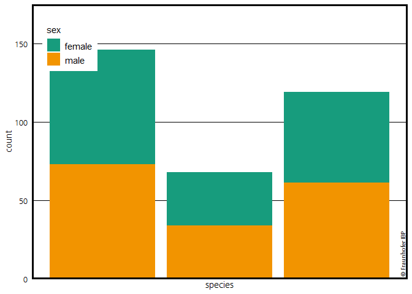
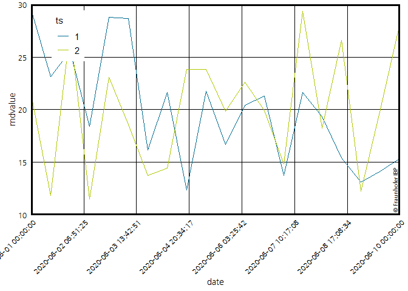

<!-- README.md is generated from README.Rmd. Please edit that file -->

# ggIBPplot

<!-- badges: start -->

<!-- badges: end -->

Stellt ein theme\_ibp für ggplot zur Vefügung. Zusätzlich einige
`scale_*` Funktionen mit Farben aus der CI vom Fraunhofer IBP. Außerdem
eine kurze Einleitung, wie man die Fraunhofer Schriftart \``Frutiger` in
R importiert und dann in den Plots verwedet.

## Installation

Bisher nur über Github

``` r
devtools::install_github("SebaStad/ggIBPplot")
```

## Example

Hier einige Beispiele, welche Bibliotheken man benötigt und wie man die
Funktionen verwenden kann.

``` r
# remotes::install_github("allisonhorst/palmerpenguins")
library(ggplot2)
library(ggIBPplot)
library(magrittr)
library(scales)
#> Warning: package 'scales' was built under R version 3.6.2
library(prismatic)
#> Warning: package 'prismatic' was built under R version 3.6.2

# Wie bekommt man Schriftarten in R? über extrafont!
library(extrafont)
# extrafont::font_import()
# Dieser Befehl importiert ALLE Schriftarten, die in Windows verfügbar sind nach R (dauert ca 10 min)! Auf den Fraunhofer Laptops sind die Frutiger Schriftarten in Windows vorhanden, daher auch verwendbar.

# Um diese zu nutzen muss man diese dann noch laden:
# extrafont::loadfonts()
## basic example code
palmerpenguins::penguins %>% 
  na.exclude() %>% 
{
ggplot(data = ., aes(x=species)) +
  geom_bar(aes(fill=sex)) +
  theme_ibp() +
  scale_y_continuous(expand = c(0,0), limits = c(0,175), breaks = pretty_breaks()) +
  scale_x_discrete(breaks = scales::pretty_breaks()) + 
  scale_fill_ibp() +
  geom_fraunhofer_label() 
}
#> Warning in pretty.default(x, n, ...): NAs durch Umwandlung erzeugt
#> Warning in pretty.default(x, n, ...): NAs durch Umwandlung erzeugt
#> Warning in grid.Call(C_stringMetric, as.graphicsAnnot(x$label)):
#> Zeichensatzfamilie in der Windows Zeichensatzdatenbank nicht gefunden
#> Warning in grid.Call(C_textBounds, as.graphicsAnnot(x$label), x$x, x$y, :
#> Zeichensatzfamilie in der Windows Zeichensatzdatenbank nicht gefunden
```



``` r

palmerpenguins::penguins %>% 
  na.exclude() %>% 
{
ggplot(data = ., aes(x=flipper_length_mm, y = body_mass_g)) +
  geom_point(aes(colour=species, shape = sex)) +
  theme_ibp(y_pos_leg = 0.7, x_pos_leg = 0.12, ibp_family = "Frutiger LT Com 55 Roman") +
  scale_x_ibp_cont() +
  scale_y_ibp_cont() +
  scale_colour_ibp() +
  geom_fraunhofer_label() +
  coord_ibp_cartesian()
}
#> Warning in grid.Call(C_textBounds, as.graphicsAnnot(x$label), x$x, x$y, :
#> Zeichensatzfamilie in der Windows Zeichensatzdatenbank nicht gefunden

#> Warning in grid.Call(C_textBounds, as.graphicsAnnot(x$label), x$x, x$y, :
#> Zeichensatzfamilie in der Windows Zeichensatzdatenbank nicht gefunden
```

 Hat man die
Schriftart, die man verwenden möchte nicht installiert, passiert
folgendes:

``` r
palmerpenguins::penguins %>% 
  na.exclude() %>% 
{
ggplot(data = ., aes(x=flipper_length_mm, y = body_mass_g)) +
  geom_point(aes(colour=species, shape = sex)) +
  theme_ibp(y_pos_leg = 0.7, x_pos_leg = 0.12, ibp_family = "Testfont that doesnt exist") +
  scale_x_ibp_cont() +
  scale_y_ibp_cont() +
  scale_colour_ibp() +
  geom_fraunhofer_label() +
  coord_ibp_cartesian()
}
#> Warning in grid.Call(C_stringMetric, as.graphicsAnnot(x$label)):
#> Zeichensatzfamilie in der Windows Zeichensatzdatenbank nicht gefunden

#> Warning in grid.Call(C_stringMetric, as.graphicsAnnot(x$label)):
#> Zeichensatzfamilie in der Windows Zeichensatzdatenbank nicht gefunden
#> Warning in grid.Call(C_textBounds, as.graphicsAnnot(x$label), x$x, x$y, :
#> Zeichensatzfamilie in der Windows Zeichensatzdatenbank nicht gefunden

#> Warning in grid.Call(C_textBounds, as.graphicsAnnot(x$label), x$x, x$y, :
#> Zeichensatzfamilie in der Windows Zeichensatzdatenbank nicht gefunden

#> Warning in grid.Call(C_textBounds, as.graphicsAnnot(x$label), x$x, x$y, :
#> Zeichensatzfamilie in der Windows Zeichensatzdatenbank nicht gefunden

#> Warning in grid.Call(C_textBounds, as.graphicsAnnot(x$label), x$x, x$y, :
#> Zeichensatzfamilie in der Windows Zeichensatzdatenbank nicht gefunden

#> Warning in grid.Call(C_textBounds, as.graphicsAnnot(x$label), x$x, x$y, :
#> Zeichensatzfamilie in der Windows Zeichensatzdatenbank nicht gefunden

#> Warning in grid.Call(C_textBounds, as.graphicsAnnot(x$label), x$x, x$y, :
#> Zeichensatzfamilie in der Windows Zeichensatzdatenbank nicht gefunden

#> Warning in grid.Call(C_textBounds, as.graphicsAnnot(x$label), x$x, x$y, :
#> Zeichensatzfamilie in der Windows Zeichensatzdatenbank nicht gefunden

#> Warning in grid.Call(C_textBounds, as.graphicsAnnot(x$label), x$x, x$y, :
#> Zeichensatzfamilie in der Windows Zeichensatzdatenbank nicht gefunden
#> Warning in grid.Call.graphics(C_text, as.graphicsAnnot(x$label), x$x, x$y, :
#> Zeichensatzfamilie in der Windows Zeichensatzdatenbank nicht gefunden
#> Warning in grid.Call(C_textBounds, as.graphicsAnnot(x$label), x$x, x$y, :
#> Zeichensatzfamilie in der Windows Zeichensatzdatenbank nicht gefunden
```


Die Linien für die “Grid”-Quadrate sind abhängig von den Daten der X und
Y Achse, sowie der Aspekt-Ratio des Plots. Es gibt jetzt für kartesische
Koordinaten nun die Funktion `coord_ibp_cartesian()`, die die
Aspekt-Ratio automatisch korrekt setzt. Dabei wird folgende
Formel/Funktion verwendet:

``` r
                    aspect = function(self, ranges) {
                      d_x = diff(ranges$x.major_source)[1]
                      d_y = diff(ranges$y.major_source)[1]

                      (d_x * diff(ranges$y.range)) / (d_y * diff(ranges$x.range))
                    }
```

Gleichzeitig ersetzt es das bisher benötigte `coord_ibp_cartesian()`,
indem es sonst die gleichen Funktionen hat. Außerdem ist es nicht mehr
nötig, in `theme_ibp` die Aspekt-Ratio anzugeben\!

``` r
palmerpenguins::penguins %>% 
  na.exclude() %>% 
{
ggplot(data = ., aes(x=flipper_length_mm, y = body_mass_g)) +
  geom_point(aes(colour=species, shape = sex)) +
  theme_ibp(y_pos_leg = 0.7,  ibp_family = "Felix Titling") +
  scale_x_ibp_cont() +
  scale_y_ibp_cont() +
  scale_colour_ibp() +
  geom_fraunhofer_label() +
  coord_ibp_cartesian()
}
#> Warning in grid.Call(C_textBounds, as.graphicsAnnot(x$label), x$x, x$y, :
#> Zeichensatzfamilie in der Windows Zeichensatzdatenbank nicht gefunden

#> Warning in grid.Call(C_textBounds, as.graphicsAnnot(x$label), x$x, x$y, :
#> Zeichensatzfamilie in der Windows Zeichensatzdatenbank nicht gefunden
```


``` r


palmerpenguins::penguins %>% 
  na.exclude() %>% 
{
ggplot(data = ., aes(x=bill_length_mm, y = bill_depth_mm)) +
  geom_point(aes(colour=species, shape = sex)) +
  theme_ibp(y_pos_leg = 0.65) +
  scale_x_ibp_cont(limits = c(32,60), n = 8) +
  scale_y_ibp_cont(limits = c(12.5,22)) +
  scale_colour_ibp(values = ibp_cols$old[4:6]) +
  geom_fraunhofer_label() +
  coord_ibp_cartesian()
}
#> Warning in grid.Call(C_textBounds, as.graphicsAnnot(x$label), x$x, x$y, :
#> Zeichensatzfamilie in der Windows Zeichensatzdatenbank nicht gefunden
```


Es gibt auch `scale_x_ibp_date`:

``` r
dat <- tibble::tibble("rndvalue" = runif(40, min = 10, max = 30),
                          "date" = rep(seq(as.Date("2020-06-01"), as.Date("2020-06-20"), length.out = 20),2),
                          "ts" = c(rep("1",20), rep("2", 20)),
                          stringsAsFactors = F)

ggplot(dat , aes(y = rndvalue, x = date)) + 
  geom_line(aes(color = ts)) +
  # Wichtig:
  # Ich selber habe hier Fehlermeldungen bekommen, wenn ich color = ts in den ggplot aes gesteckt habe
  # und Gleichzeitig geom_fraunhofer_label_date verweden hab.
  theme_ibp() + 
  scale_x_ibp_date() +
  scale_y_ibp_cont() +
  scale_colour_ibp(values = ibp_cols$all[4:5]) +
  geom_fraunhofer_label_date() +
  coord_ibp_cartesian() 
#> Warning in grid.Call(C_textBounds, as.graphicsAnnot(x$label), x$x, x$y, :
#> Zeichensatzfamilie in der Windows Zeichensatzdatenbank nicht gefunden

#> Warning in grid.Call(C_textBounds, as.graphicsAnnot(x$label), x$x, x$y, :
#> Zeichensatzfamilie in der Windows Zeichensatzdatenbank nicht gefunden
```


``` r


dat2 <- tibble::tibble("rndvalue" = runif(40, min = 10, max = 30),
                          "date" = rep(seq(as.POSIXct("2020-06-01"),as.POSIXct("2020-06-10"), length.out = 20),2),
                          "ts" = c(rep("1",20), rep("2", 20)),
                          stringsAsFactors = F)

ggplot(dat2 , aes(y = rndvalue, x = date)) + 
  geom_line(aes(color = ts)) +
  # Wichtig:
  # Ich selber habe hier Fehlermeldungen bekommen, wenn ich color = ts in den ggplot aes gesteckt habe
  # und Gleichzeitig geom_fraunhofer_label_date verweden hab.
  theme_ibp() + 
  scale_x_ibp_datetime(n = 8) +
  # leading rundet die Grenzen der Achse!
  scale_y_ibp_cont(leading = 2) +
  scale_colour_ibp(values = ibp_cols$all[4:5]) +
  geom_fraunhofer_label_datetime() +
  theme(axis.text.x = element_text(angle = 45, hjust = 1)) +
  coord_ibp_cartesian() 
#> Warning in grid.Call(C_textBounds, as.graphicsAnnot(x$label), x$x, x$y, :
#> Zeichensatzfamilie in der Windows Zeichensatzdatenbank nicht gefunden
```



Beeinhaltet auch einige Farben aus der IBP CI, sowie die Farbskalen von
Matthias aus dem Base `IBPplot` package. `ppoint` Sind die Farben aus
der aktuellen Powerpoint-Vorlage.

``` r
names(ibp_cols)
#>  [1] "ppoint"   "all"      "logo"     "grey"     "orange"   "blue"    
#>  [7] "green"    "tuer"     "old"      "old_matt"
par(mfrow = c(2,5))
lapply(ibp_cols, prismatic:::plot.colors)
```


    #> $ppoint
    #> NULL
    #> 
    #> $all
    #> NULL
    #> 
    #> $logo
    #> NULL
    #> 
    #> $grey
    #> NULL
    #> 
    #> $orange
    #> NULL
    #> 
    #> $blue
    #> NULL
    #> 
    #> $green
    #> NULL
    #> 
    #> $tuer
    #> NULL
    #> 
    #> $old
    #> NULL
    #> 
    #> $old_matt
    #> NULL
