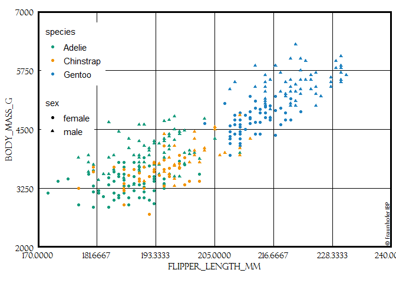

<!-- README.md is generated from README.Rmd. Please edit that file -->

# ggIBPplot

<!-- badges: start -->

<!-- badges: end -->

Stellt ein theme\_ibp für ggplot zur Vefügung. Zusätzlich einige
`scale_*` Funktionen mit Farben aus der CI vom Fraunhofer IBP.

## Installation

Gibts bisher nur manual. Eventuell von Github über;

``` r
devtools::install_github("SebaStad/ggIBPplot")
```

## Example

This is a basic example which shows you how to solve a common problem:

``` r
# remotes::install_github("allisonhorst/palmerpenguins")
library(ggplot2)
library(ggIBPplot)
library(magrittr)
library(scales)
## basic example code
palmerpenguins::penguins %>% 
  na.exclude() %>% 
{
ggplot(data = ., aes(x=species)) +
  geom_bar(aes(fill=sex)) +
  theme_ibp() +
  scale_y_continuous(expand = c(0,0), limits = c(0,175), breaks = pretty_breaks()) +
  scale_x_discrete(breaks = scales::pretty_breaks()) + 
  scale_fill_ibp() +
  geom_fraunhofer_label() 
}
#> Warning in pretty.default(x, n, ...): NAs durch Umwandlung erzeugt

#> Warning in pretty.default(x, n, ...): NAs durch Umwandlung erzeugt
#> Warning in grid.Call(C_stringMetric, as.graphicsAnnot(x$label)):
#> Zeichensatzfamilie in der Windows Zeichensatzdatenbank nicht gefunden
#> Warning in grid.Call(C_textBounds, as.graphicsAnnot(x$label), x$x, x$y, :
#> Zeichensatzfamilie in der Windows Zeichensatzdatenbank nicht gefunden

#> Warning in grid.Call(C_textBounds, as.graphicsAnnot(x$label), x$x, x$y, :
#> Zeichensatzfamilie in der Windows Zeichensatzdatenbank nicht gefunden
```


``` r

palmerpenguins::penguins %>% 
  na.exclude() %>% 
{
ggplot(data = ., aes(x=flipper_length_mm, y = body_mass_g)) +
  geom_point(aes(colour=species, shape = sex)) +
  theme_ibp(y_pos_leg = 0.7, x_pos_leg = 0.12) +
  scale_x_ibp_cont() +
  scale_y_ibp_cont() +
  scale_colour_ibp() +
  geom_fraunhofer_label() +
  coord_fixed()
}
#> Warning in grid.Call(C_textBounds, as.graphicsAnnot(x$label), x$x, x$y, :
#> Zeichensatzfamilie in der Windows Zeichensatzdatenbank nicht gefunden
```


Die Linien für die “Grid”-Quadrate sind abhängig von den Daten der X und
Y Achse, sowie der Aspekt-Ratio des Plots. Standardmäßig produziert
`scale_x_ibp_cont` 7 Linien (+ Rand), sowie `scale_y_ibp_cont` 5 Linien
(+Rand) und besitzen dabei eine Aspekt-Ratio von 5.5/8. Je nach Range
der Daten müssen diese Werte manual angepasst werden. Eine automatische
Lösung wäre sicher wünschenswert, aber wohl auch aufwendiger.
`coord_fixed` ist auch notwendig.

``` r
palmerpenguins::penguins %>% 
  na.exclude() %>% 
{
ggplot(data = ., aes(x=flipper_length_mm, y = body_mass_g)) +
  geom_point(aes(colour=species, shape = sex)) +
  theme_ibp(y_pos_leg = 0.7, aspect = 5/7.5) +
  scale_x_ibp_cont(limits = c(170,230)) +
  scale_y_ibp_cont(limits = c(2500,6500)) +
  scale_colour_ibp() +
  geom_fraunhofer_label() +
  coord_fixed()
}
#> Warning: Removed 1 rows containing missing values (geom_point).
#> Warning in grid.Call(C_textBounds, as.graphicsAnnot(x$label), x$x, x$y, :
#> Zeichensatzfamilie in der Windows Zeichensatzdatenbank nicht gefunden

#> Warning in grid.Call(C_textBounds, as.graphicsAnnot(x$label), x$x, x$y, :
#> Zeichensatzfamilie in der Windows Zeichensatzdatenbank nicht gefunden
```



``` r


palmerpenguins::penguins %>% 
  na.exclude() %>% 
{
ggplot(data = ., aes(x=bill_length_mm, y = bill_depth_mm)) +
  geom_point(aes(colour=species, shape = sex)) +
  theme_ibp(y_pos_leg = 0.65, aspect = 5/9.5) +
  scale_x_ibp_cont(limits = c(32,60), n = 8) +
  scale_y_ibp_cont(limits = c(12.5,22)) +
  scale_colour_ibp() +
  geom_fraunhofer_label() +
  coord_fixed()
}
#> Warning in grid.Call(C_textBounds, as.graphicsAnnot(x$label), x$x, x$y, :
#> Zeichensatzfamilie in der Windows Zeichensatzdatenbank nicht gefunden
```


Es gibt auch `scale_x_ibp_date`, allerdings ungetestet. Beeinhaltet auch
einige Farben aus der IBP CI.

``` r
prismatic::color(ibp_cols) %>% 
  plot()
```


